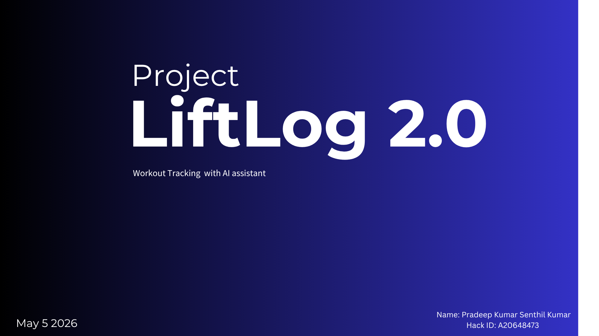
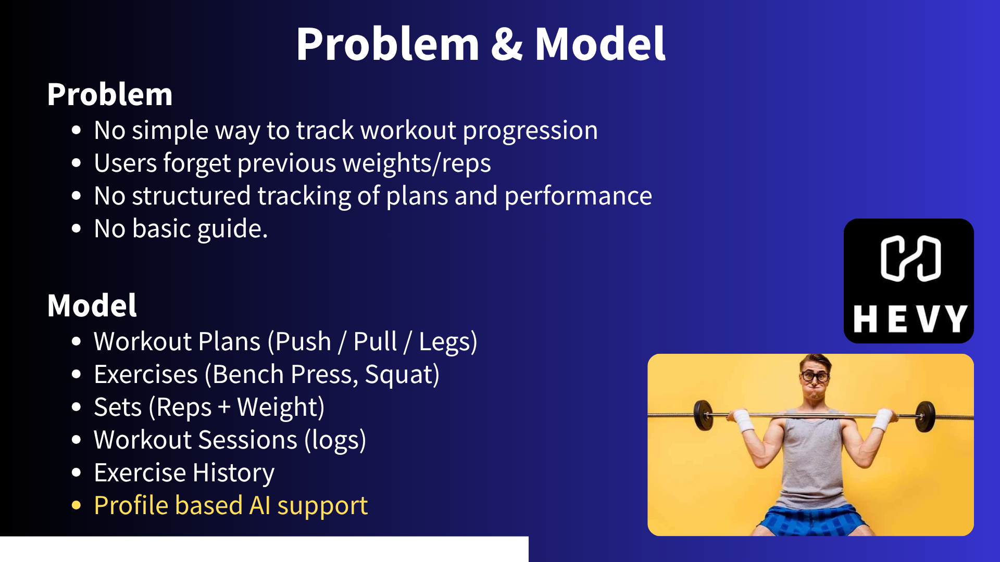
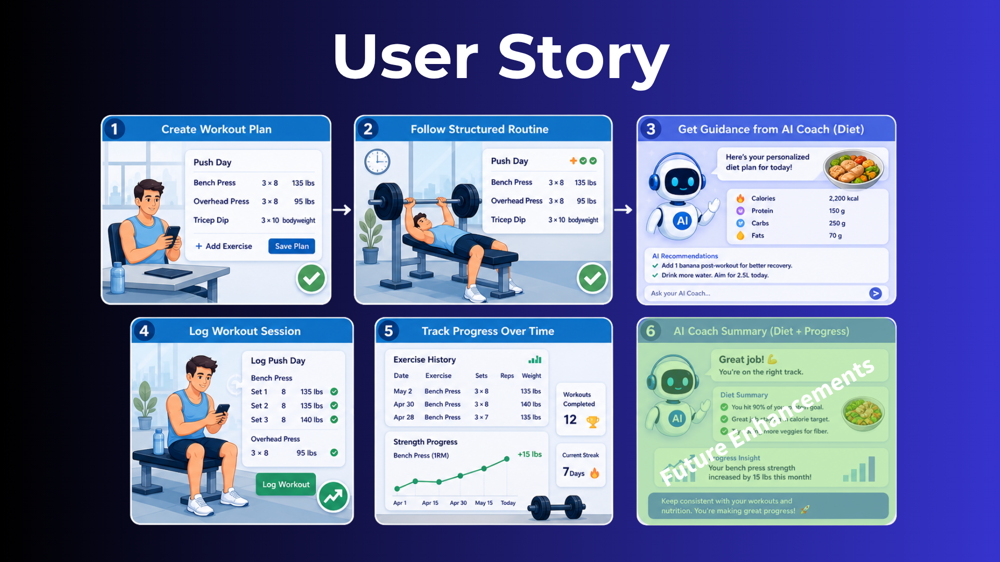
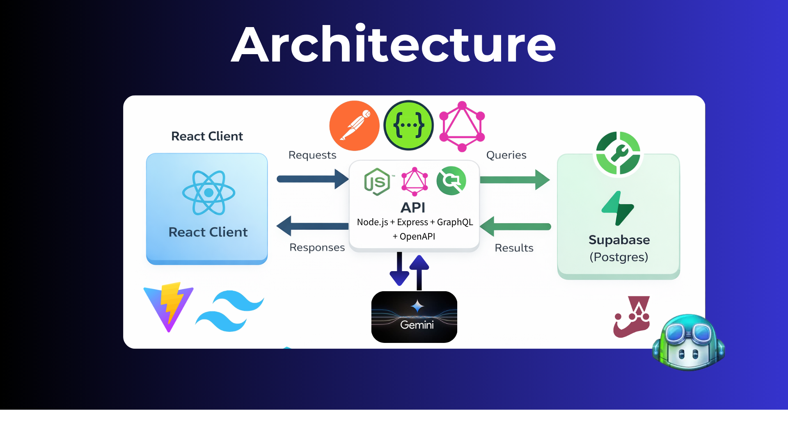
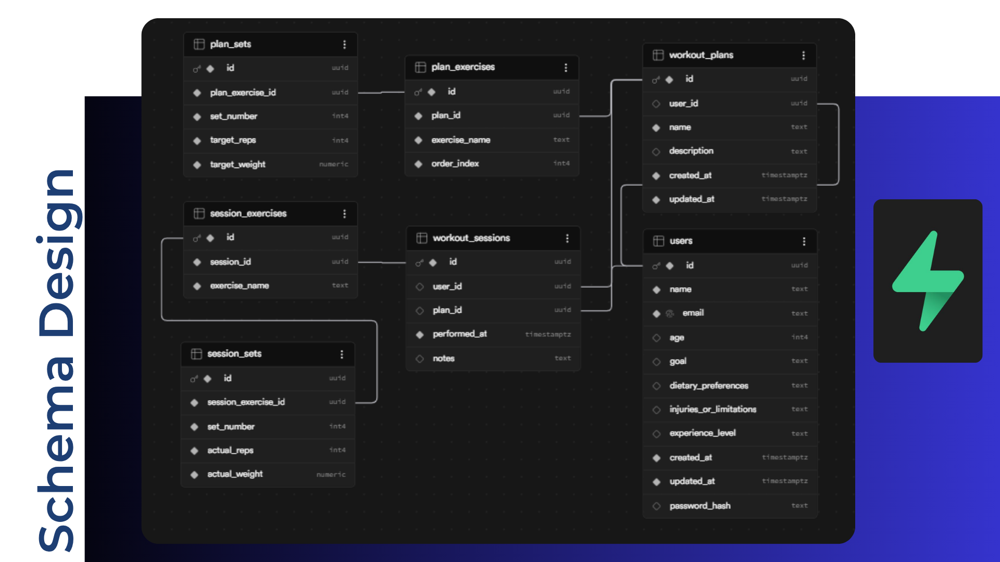

# LoadLog API

## Presentation Walkthrough

Use this section to explain the project directly from the README during your presentation.

### 1. Project Introduction

This slide introduces LoadLog 2.0 as a workout tracking system with AI assistant support.



### 2. Problem Statement And Core Model

This slide explains the problem the project solves and the main domain entities in the system.

- Users need a simple way to track workout progression
- Users forget previous weights and reps
- The system models workout plans, exercises, sets, workout sessions, and exercise history
- AI support is included for personalized help



### 3. User Flow


- Create a workout plan
- Follow a structured routine
- Ask the AI coach for guidance
- Log the workout session
- Track progress over time
- Receive AI summary and recommendations



### 4. System Architecture

This slide explains how the full stack is connected.

- Frontend: React client built with Vite and TypeScript
- Backend: Node.js, Express, REST, GraphQL, and OpenAPI
- Database: Supabase with PostgreSQL
- External AI integration: Gemini

The React frontend sends requests to the backend API. The backend handles authentication, validation, REST endpoints, GraphQL queries, and database operations. Gemini is used by the AI coach service for contextual responses.



### 5. Database Schema

This slide explains the relational schema behind the backend.

- `users`
- `workout_plans`
- `plan_exercises`
- `plan_sets`
- `workout_sessions`
- `session_exercises`
- `session_sets`

This schema supports one-to-many relationships for both planned workouts and completed workout logs.




A professional, production-ready GraphQL API for fitness workout tracking built with Node.js, TypeScript, and Supabase.

## 🚀 Features

- **GraphQL API** with comprehensive schema for workout plans, sessions, and exercise history
- **REST API** with OpenAPI/Swagger documentation
- **TypeScript** for type safety and better developer experience
- **Supabase** integration for database operations
- **Security** middleware with Helmet, CORS, and rate limiting
- **Error handling** with structured logging
- **Input validation** using Joi
- **Testing** with Jest and Supertest
- **Linting** with ESLint and Prettier
- **Health checks** and monitoring endpoints

## 📋 Prerequisites

- Node.js 18+
- npm 8+
- Supabase account and project

## 🛠️ Installation

1. Clone the repository:
```bash
git clone <repository-url>
cd loadlog-api
```

2. Install dependencies:
```bash
npm install
```

3. Set up environment variables:
```bash
cp .env.example .env
```

Edit `.env` with your Supabase credentials:
```env
SUPABASE_URL=your-supabase-url
SUPABASE_ANON_KEY=your-supabase-anon-key
JWT_SECRET=replace-with-a-long-random-secret
JWT_EXPIRES_IN=7d
GEMINI_API_KEY=your-gemini-api-key
GEMINI_MODEL=gemini-2.5-flash
NODE_ENV=development
PORT=3000
```

5. Apply the auth migration in Supabase:
```sql
alter table public.users add column if not exists password_hash text;
create unique index if not exists users_email_unique_idx on public.users (lower(email));
```

4. Start the development server:
```bash
npm run dev
```

## 📖 API Documentation

### GraphQL Playground
Visit `http://localhost:3000/graphql` for the interactive GraphiQL explorer.

### REST API Documentation
Visit `http://localhost:3000/docs` for Swagger UI documentation.

### Production API
- Base URL: `https://loadlog-api.onrender.com/`
- Swagger UI: `https://loadlog-api.onrender.com/docs`
- GraphQL UI: `https://loadlog-api.onrender.com/graphql`

### Health Check
```bash
GET /health
```

## 🧪 Testing

Run the test suite:
```bash
npm test
```

Run tests with coverage:
```bash
npm run test:coverage
```

Run tests in watch mode:
```bash
npm run test:watch
```

## 🛠️ Development Scripts

```bash
# Development
npm run dev              # Start development server with hot reload
npm run build            # Build for production
npm start                # Start production server

# Code Quality
npm run lint             # Run ESLint
npm run lint:fix         # Fix ESLint issues
npm run format           # Format code with Prettier
npm run format:check     # Check code formatting
npm run type-check       # Run TypeScript type checking

# Testing
npm test                 # Run tests
npm run test:watch       # Run tests in watch mode
npm run test:coverage    # Run tests with coverage

# Utilities
npm run clean            # Clean build artifacts
```

## 🏗️ Project Structure

```
src/
├── config/              # Configuration management
│   └── index.ts
├── graphql/             # GraphQL schema and resolvers
│   └── schema.ts
├── handlers/            # REST API handlers
├── middleware/          # Express middleware
│   ├── errorHandler.ts
│   └── security.ts
├── models/              # Data models and types
├── routes/              # API routes
├── store/               # Data access layer
├── utils/               # Utility functions
│   ├── logger.ts
│   └── validation.ts
└── index.ts             # Application entry point

tests/                   # Test files
├── graphql.test.ts
└── setup.ts
```

## 🔒 Security

- **Helmet** for security headers
- **CORS** configuration for allowed origins
- **Rate limiting** to prevent abuse
- **Input validation** with Joi schemas
- **Error handling** that doesn't leak sensitive information

## 📊 Monitoring

- Structured logging with Winston
- Health check endpoint
- Request logging middleware
- Error tracking and reporting

## 🚀 Deployment

### Environment Variables

| Variable | Description | Required |
|----------|-------------|----------|
| `SUPABASE_URL` | Your Supabase project URL | Yes |
| `SUPABASE_ANON_KEY` | Your Supabase anonymous key | Yes |
| `JWT_SECRET` | Secret used to sign auth tokens | Yes |
| `JWT_EXPIRES_IN` | JWT lifetime (example: `7d`) | No |
| `GEMINI_API_KEY` | Gemini API key for coach chat | No |
| `GEMINI_MODEL` | Gemini model name | No |
| `NODE_ENV` | Environment (development/production) | No |
| `PORT` | Server port | No (default: 3000) |

### Production Build

```bash
npm run build
npm start
```

### Azure Deployment With GitHub Actions

The backend repo includes an Azure App Service deployment workflow:

`Loadlog api/.github/workflows/azure-deploy.yml`

Note:

- The GitHub Actions workflow was prepared for Azure deployment, but it could not be used in practice because the Azure subscription did not have enough free quota to create the required Web App/App Service resources.
- Azure portal error at the time of deployment: `Operation cannot be completed without additional quota` with `Current Limit (Free VMs): 0` and `Amount required for this deployment (Free VMs): 1`.
- Because of that quota restriction, the project deployment was completed using Render instead of Azure.

Set these GitHub repository variables:

- `AZURE_RESOURCE_GROUP`
- `AZURE_WEBAPP_NAME`
- `AZURE_CONTAINER_REGISTRY_LOGIN_SERVER`
- `AZURE_IMAGE_NAME`

Set these GitHub repository secrets:

- `AZURE_CLIENT_ID`
- `AZURE_TENANT_ID`
- `AZURE_SUBSCRIPTION_ID`
- `AZURE_REGISTRY_USERNAME`
- `AZURE_REGISTRY_PASSWORD`
- `SUPABASE_URL`
- `SUPABASE_ANON_KEY`
- `JWT_SECRET`
- `JWT_EXPIRES_IN`
- `GEMINI_API_KEY`
- `GEMINI_MODEL`

### Docker (Optional)

```dockerfile
FROM node:18-alpine
WORKDIR /app
COPY package*.json ./
RUN npm ci --only=production
COPY dist/ ./dist/
EXPOSE 3000
CMD ["npm", "start"]
```

## 🤝 Contributing

1. Fork the repository
2. Create a feature branch: `git checkout -b feature/your-feature`
3. Run tests: `npm test`
4. Lint code: `npm run lint`
5. Format code: `npm run format`
6. Commit changes: `git commit -am 'Add your feature'`
7. Push to branch: `git push origin feature/your-feature`
8. Submit a pull request

## 📝 License

This project is licensed under the MIT License - see the [LICENSE](LICENSE) file for details.

## 👥 Authors

- **Pradeep Kumar Senthil** - *Initial work*

## 🙏 Acknowledgments

- Supabase for the excellent backend-as-a-service
- GraphQL for the query language
- The Node.js community for amazing tools and libraries

Required environment variables in `.env`:

```env
SUPABASE_URL=your_supabase_project_url
SUPABASE_ANON_KEY=your_supabase_anon_key
GEMINI_API_KEY=your_gemini_api_key
GEMINI_MODEL=gemini-2.5-flash
PORT=3000
```

## GraphQL examples

List workout plans:

```graphql
query {
  workoutPlans {
    items {
      id
      name
      createdAt
    }
    pagination {
      page
      pageSize
      totalItems
      totalPages
    }
  }
}
```

Filter workout plans by partial name:

```graphql
query {
  workoutPlans(nameContains: "push", page: 1, pageSize: 5) {
    items {
      id
      name
    }
    pagination {
      page
      pageSize
      totalItems
      totalPages
    }
  }
}
```

List workout sessions for one plan:

```graphql
query {
  workoutSessions(planId: "plan-id-here", page: 1, pageSize: 5) {
    items {
      id
      performedAt
      notes
    }
    pagination {
      page
      pageSize
      totalItems
      totalPages
    }
  }
}
```

Create a workout plan:

```graphql
mutation {
  createWorkoutPlan(
    input: {
      name: "Upper Body A"
      description: "Chest and back focus"
      exercises: [
        {
          exerciseName: "Bench Press"
          order: 1
          sets: [
            { setNumber: 1, targetReps: 8, targetWeight: 60 }
            { setNumber: 2, targetReps: 8, targetWeight: 60 }
          ]
        }
      ]
    }
  ) {
    id
    name
  }
}
```

Create a workout session:

```graphql
mutation {
  createWorkoutSession(
    input: {
      planId: "plan-id-here"
      notes: "Felt strong"
      exercises: [
        {
          exerciseName: "Bench Press"
          sets: [
            { setNumber: 1, actualReps: 8, actualWeight: 60 }
            { setNumber: 2, actualReps: 7, actualWeight: 60 }
          ]
        }
      ]
    }
  ) {
    id
    performedAt
  }
}
```
